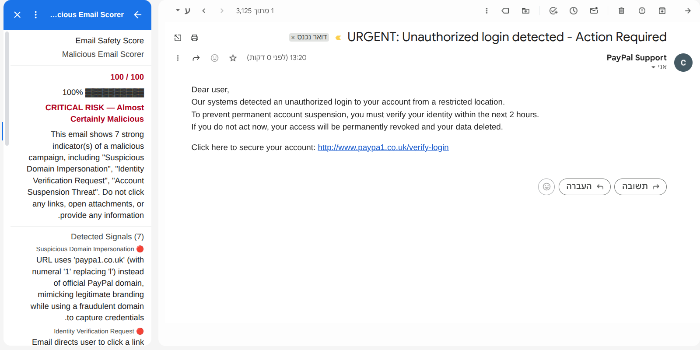
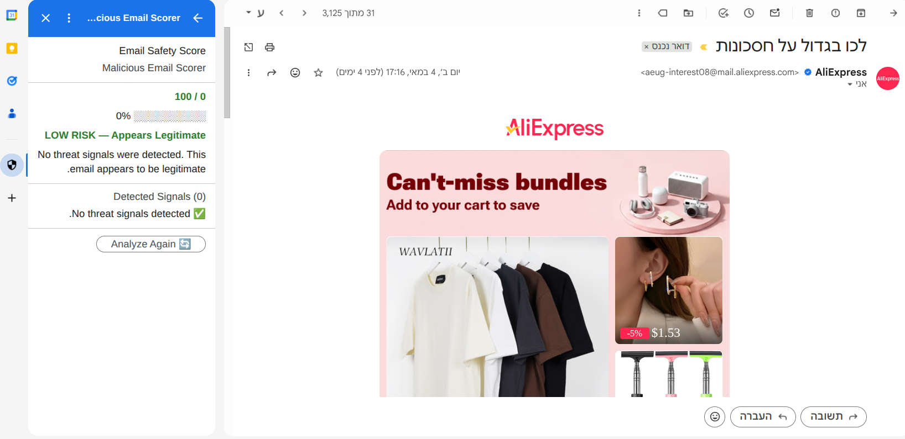

# Malicious Email Scorer - Gmail Add-on

A Gmail Add-on that analyzes the currently open email and presents a maliciousness score (0-100), a risk verdict, and per-signal reasoning directly in the Gmail sidebar.

---

## TL;DR

A Gmail Add-on for phishing detection that combines:

- **Rule-based security analysis** - SPF/DKIM/DMARC, spoofing detection, URL inspection.
- **AI-based detection** - Claude-powered semantic analysis for social engineering and linguistic anomalies.
- **Verified Brand Handling** - Context-aware scoring to reduce false positives from legitimate automated alerts.

**Built with:** Google Apps Script, FastAPI, Claude Haiku, and a modular analyzer architecture.
**Designed for:** Privacy-by-design (client-side PII anonymization), explainability, and defense-in-depth.

---

## Table of Contents

1. [What It Does](#what-it-does)
2. [Usage](#usage)
3. [Architecture](#architecture)
4. [Advanced Security Architecture](#advanced-security-architecture)
5. [Key Technologies](#key-technologies)
6. [Modular Architecture and Separation of Concerns](#modular-architecture-and-separation-of-concerns)
7. [Architectural Trade-offs and Decisions](#architectural-trade-offs-and-decisions)
8. [Signals Analyzed](#signals-analyzed)
9. [Security and Privacy Design](#security-and-privacy-design)
10. [Running Locally](#running-locally)
11. [Project Structure](#project-structure)
12. [Future Roadmap](#future-roadmap)

---

## What It Does

When you open any email in Gmail, the add-on sidebar shows:

- **Score** - a number from 0 to 100 (higher = more dangerous)
- **Risk level** - LOW / MEDIUM / HIGH / CRITICAL, color-coded
- **Verdict** - a one-line summary (e.g., *"Likely Phishing or Scam"*)
- **Signal breakdown** - every detected flag, its severity, and a plain-English explanation
- **Analyze Again** - re-run on demand

| High Risk Detection | Low Risk Detection |
|:---:|:---:|
|  |  |
| *Figure 1: Real-time analysis of a suspicious email in the Gmail sidebar.* | *Figure 2: Analysis of a legitimate email with a clean result.* |

---

## Usage

1. **Open any email** in your Gmail inbox.
2. **Click the Malicious Email Scorer icon** in the right-side panel to open the add-on sidebar.
3. **View the results** - the risk score, verdict, and detailed signal breakdown appear instantly.

> **Note:** The Google Apps Script component is currently in Developer Mode. Access is restricted to the developer's account and designated Test Users within the Google Cloud Console. This ensures a secure, isolated environment during the development and evaluation phase.

---

## Architecture

```
Gmail Add-on (Google Apps Script)
         |  [PII stripped here: emails → [EMAIL], phones → [PHONE], names → [NAME]]
         |  POST /analyze  (HTTPS - pre-anonymized payload)
         v
 FastAPI Backend (Python)
         |
         +--> Cache Manager       -- SHA-256 lookup; returns early on hit
         |
         +--> Header Analyzer     -- SPF/DKIM/DMARC, subdomain-aware brand matching, Reply-To mismatch
         |                           └─ is_verified_brand() flags official senders for scorer
         +--> URL Analyzer        -- lookalike domains, IP-based URLs, shorteners, misleading links
         +--> Content Analyzer    -- Claude for social engineering + linguistic integrity (body already clean)
         +--> Temporal Analyzer   -- delivery-time anomaly detection for financial brand emails
         +--> Scorer              -- additive sum + context-aware hard-fail floor → final score + verdict
                                     └─ verified brand: CONTENT signals dampened 80%, excluded from floor
```

### Why a hybrid rule-based + LLM approach?

| Approach | Strength | Weakness |
|---|---|---|
| Rules only | Fast, deterministic, free | Cannot understand semantic intent |
| LLM only | Understands nuance and context | Expensive, slower, not auditable per-signal |
| **Hybrid (this project)** | **Each signal is independently auditable; LLM fills gaps rules cannot** | **Slightly more complex** |

The rule-based analyzers handle unambiguous signals (SPF fail = cryptographically verified forgery attempt). Claude handles what rules cannot: patterns like urgency and pressure tactics that manifest in hundreds of different phrasings no regex can enumerate.

---

## Advanced Security Architecture

### 1. Client-Side PII Anonymization

PII is removed before the data leaves the Gmail session.

```
john.smith@company.com  →  [EMAIL]
+1 (800) 555-0199       →  [PHONE]
Dr. Sarah Connor        →  [NAME]
```

---

### 2. Verified Brand Handling

Automated alerts from financial institutions and service providers use the same patterns as phishing - urgency, call-to-action language, branded tone. Content analysis alone cannot distinguish them.

`header_analyzer.is_verified_brand()` extracts the sender's registered domain via `tldextract` and checks it against the brand-to-domain map. If it matches, the scorer dampens all `CONTENT` signals and excludes them from the hard-fail floor.

**What "verified" means:** Only AI-generated semantic signals are dampened. A verified domain with a lookalike URL or a failed SPF check still scores high - `HEADERS`/`URLS` signals bypass verification entirely.

---

### 3. Context-Aware Signal Dampening

When a sender is verified, all `SignalCategory.CONTENT` signals (AI-generated) are transformed before scoring:

| Original | After dampening |
|---|---|
| `severity=CRITICAL`, `weight=20` | `severity=MEDIUM`, `weight=4` |
| `severity=HIGH`, `weight=15` | `severity=LOW`, `weight=3` |
| `severity=MEDIUM`, `weight=10` | `severity=MEDIUM`, `weight=2` |

The signals remain visible in the sidebar breakdown (with their reduced weights), so the user can still see that urgency language was detected - they just understand it is not being treated as a threat indicator for this sender. Transparency is preserved.

For verified senders, `CONTENT` signals are ignored by the floor logic. Only `HEADERS` and `URLS` signals can trigger the floor - urgency language alone should never lock a sender with clean technical authentication at 90/CRITICAL.

---

---

## Key Technologies

| Layer | Technology |
|---|---|
| **Frontend** | Google Apps Script (V8 runtime), JavaScript, Card Service API, Gmail REST API (metadata headers: `Received-SPF`, `Authentication-Results`, `DKIM-Signature`, `Reply-To`, `Date`), client-side Regex engine for PII anonymization |
| **Backend** | Python 3.12, FastAPI, Uvicorn, Pydantic |
| **AI and Security** | Claude Haiku (Anthropic API) - configurable; supports Claude Sonnet for higher-accuracy semantic analysis - `tldextract` (registered-domain extraction for subdomain-aware brand matching), Levenshtein Algorithm, SHA-256 Hashing |
| **Infrastructure** | ngrok, Docker |

---

## Modular Architecture and Separation of Concerns

### The Zero-Touch UI Principle

The system was built with a strict boundary between the frontend (Gmail Add-on) and the backend (FastAPI server). The Apps Script layer has exactly one job: read the open email, assemble a structured JSON payload, send it to the backend, and render whatever comes back. No analysis logic lives in the frontend.

This was a deliberate choice from the start. Google Apps Script is a constrained, difficult-to-test environment. Keeping all business logic on the Python backend means the analysis pipeline can be developed, tested, and debugged with standard tools, while the add-on stays simple and stable.

### Seamless Evolution in Practice

The value of this separation became clear across two iterations of the project. In the first iteration, result caching (`cache_manager.py`) was added entirely on the backend - the add-on sent the same payload it always did and received the same `AnalysisResult` shape. The frontend was not touched.

In the second iteration, the PII anonymization layer was *moved* from the backend to the frontend - a privacy-by-design improvement. The backend contract (the `EmailPayload` schema) did not change; the subject and body fields simply arrive pre-anonymized. The backend's analyzers, scorer, and cache logic required no modification.

This is the practical payoff of a clean API boundary: moving a cross-cutting concern from one layer to another required changes only in the layer being changed. No downstream code broke, and the add-on continued to send the same JSON shape it always had.

---

## Architectural Trade-offs and Decisions

### 1. Privacy-First Analysis (Client-Side PII Anonymization)

**Decision:** Strip all recognizable PII (email addresses, phone numbers, titled names) from the email text *in the browser*, before the payload is transmitted to the backend.

**Why:** Moving the anonymization boundary from the backend to the Gmail Add-on (`EmailParser.gs`) means PII is scrubbed before it ever leaves the user's Gmail session. The backend receives a pre-cleaned payload. The Claude API never sees raw personal data. This is a stronger privacy guarantee than server-side anonymization, which still exposes the raw content to the network transit and server process.

**The trade-off:** After anonymization, embedded email addresses in the body are replaced with `[EMAIL]`. This means Claude cannot reason about specific domain names in the body text. We accept this loss because:

- Header analysis (SPF/DKIM/DMARC, display-name spoofing, Reply-To mismatch) and URL analysis run on the original `from_address` and header fields, which are *not* anonymized - they are needed for domain verification.
- The LLM's comparative advantage is detecting *semantic* signals like urgency and social engineering patterns, not validating addresses. A rule-based check is better suited for address validation.

**Implementation:** Three regex patterns in `EmailParser.gs` mirror the original Python anonymizer:
- Email addresses → `[EMAIL]`
- Phone numbers (US/international formats) → `[PHONE]`
- Names preceded by a common honorific (`Mr.`, `Dr.`, `Prof.`, etc.) → `[NAME]`

---

### 2. Heuristic Scoring vs. Machine Learning

**Decision:** Use a fixed, weighted scoring system where each signal contributes a predetermined integer weight to the total score.

**Why:** The task specification requires an explainable verdict with per-signal reasoning. A weighted heuristic system maps directly to this requirement: every point in the final score can be traced back to a specific, named signal with a human-readable description.

**The trade-off:**

| | Weighted Heuristics (current) | ML-Based Scoring (future) |
|---|---|---|
| Explainability | Full - each signal is auditable | Partial - requires interpretability tooling |
| Calibration | Manual - weights are educated guesses | Data-driven - learned from labeled examples |
| Coverage | Limited to signals someone thought to write | Can learn subtle correlations from data |
| Maintenance | Requires manual tuning as tactics evolve | Requires labeled data and retraining pipeline |

For a project at this stage, the heuristic approach is the right call. It produces results that are easy to understand, debug, and demonstrate. The ML path becomes worth the cost when there is a labeled dataset and a feedback mechanism to keep the model calibrated against current phishing tactics.

---

### 3. Performance vs. Freshness (Result Caching)

**Decision:** Cache analysis results in memory (with JSON file persistence) keyed by a SHA-256 hash of the email's subject and body.

**Cache key generation:**

```python
# subject and body are joined with a null byte to prevent
# hash collisions between ("ab", "cd") and ("a", "bcd")
raw = f"{subject}\x00{body}".encode()
key = hashlib.sha256(raw).hexdigest()
```

**Why SHA-256:** The hash is a fixed-length fingerprint of the email content. Two emails with identical subject and body will always produce the same key, so a cached result can be returned immediately without calling any analyzer. SHA-256 is collision-resistant enough that false cache hits are not a practical concern.

**The trade-off:** The cache assumes that identical email content always warrants the same verdict. This is true for bulk phishing campaigns (where the same template is sent to many recipients), which is also the scenario where caching provides the most benefit. The trade-off is that if the signal weights or detection logic are updated, cached results will be stale until the cache is cleared. For this demo, that is acceptable - a production system would version the cache keys alongside the analyzer code.

**Scope:** For this demo, storage is an in-memory dictionary that persists to a local JSON file on each write. In production, this would be replaced with a shared cache (Redis or similar) to work correctly across multiple server instances.

---

## Signals Analyzed

### Header Signals (deterministic)

| Signal | Weight | Rationale |
|---|---|---|
| SPF Authentication Failed | 25 | The sending server is not authorized for this domain. Hard cryptographic evidence of sender forgery. |
| SPF Soft Fail | 12 | Domain policy marks this server as suspect but not definitively unauthorized. |
| DKIM Signature Invalid | 15 | The message body was altered in transit or the sender's key does not match. |
| DMARC Policy Violation | 15 | The domain owner's explicit policy flags this message as fraudulent. |
| Display Name Spoofing | 20 | Display name claims to be a known brand but the registered domain of the sender does not match. Uses `tldextract` to compare registered domains, so `no-reply@accounts.google.com` correctly passes the Google check. The most common phishing technique - easy to execute, highly effective against non-technical users. |
| Reply-To Domain Mismatch | 15 | Sender and Reply-To are on different domains - replies go to an attacker-controlled inbox without the forged domain. |
| Temporal Anomaly Detected | 10 | Email purportedly from a financial institution (PayPal, Chase, IRS, etc.) was delivered on a weekend or outside business hours (10 PM – 6 AM) in the sender's local timezone. Automated alerts from banks operate on predictable business-hour schedules; deep-night delivery is a meaningful anomaly. |

### URL Signals (deterministic)

| Signal | Weight | Rationale |
|---|---|---|
| Lookalike Domain | 25 | Domain is within Levenshtein distance 2 of a known brand (paypa1.com, g00gle.com) or uses subdomain abuse (paypal.com.evil.net). Highest-weight URL signal because it directly enables credential theft. |
| IP-Based URL | 15 | No legitimate service links users to a raw IP address. |
| URL Shortener | 10 | Conceals the true destination. Weighted lower because shorteners have legitimate uses - treated as a supporting signal, not a standalone red flag. |
| Misleading Link Text | 20 | Visible link text shows one domain but href points to another. Deliberate deception. |

#### How Lookalike Domain Detection Works

Lookalike detection is based on Levenshtein distance - a measure of how many single-character edits (insertions, deletions, or substitutions) are needed to turn one string into another.

**Example:**
```
"paypal"  vs  "paypa1"  ->  distance = 1  (one substitution: l -> 1)
"google"  vs  "gooogle" ->  distance = 1  (one insertion: extra 'o')
"microsoft" vs "micros0ft" -> distance = 1  (one substitution: o -> 0)
```

Any domain name with a distance of 2 or less from a known brand is flagged as a lookalike.

**Target brand list (44 brands protected):**

| Category | Brands |
|---|---|
| Big tech and cloud | `paypal`, `apple`, `google`, `microsoft`, `amazon`, `adobe`, `dropbox`, `icloud`, `github`, `zoom`, `slack`, `docusign`, `salesforce` |
| Social and communication | `netflix`, `facebook`, `instagram`, `linkedin`, `twitter`, `tiktok`, `snapchat`, `whatsapp`, `spotify`, `discord` |
| Email providers | `outlook`, `yahoo`, `gmail`, `hotmail`, `protonmail` |
| E-commerce and shipping | `ebay`, `walmart`, `etsy`, `fedex`, `ups`, `dhl`, `usps` |
| Banking and finance | `chase`, `wellsfargo`, `bankofamerica`, `citibank`, `capitalone`, `amex`, `hsbc`, `barclays`, `fidelity`, `schwab`, `intuit` |
| Crypto | `coinbase`, `binance`, `kraken` |
| Gaming | `steam` |

The comparison is applied to the registered domain only (e.g. `paypa1` from `paypa1.com`), not the full URL. This avoids false positives from long subdomains and focuses the check on the part of the URL that users are most likely to trust visually.

In addition to Levenshtein, the analyzer also checks for subdomain abuse: if a known brand domain appears anywhere inside a different registered domain (e.g. `paypal.com.evil.net`), it is also flagged.

### Content Signals (LLM - Claude Haiku)

Claude is asked to identify:

| Signal | Weight range | Why LLM? |
|---|---|---|
| Urgency / fear language | 5-15 | Manifests in too many phrasings for regex to enumerate reliably. |
| Credential / payment request | 10-20 | Requires understanding context, not just keyword matching. |
| Brand impersonation intent | 10-20 | The email may not name the brand explicitly but mimic its tone, formatting, or claimed authority. |
| Social engineering pattern | 5-15 | Reward bait, false authority, threat of consequence - semantic patterns only. |
| Linguistic Anomaly Detected | 10-15 | Signs of Machine Translation: wrong verb tense or gender agreement, unnatural or stilted phrasing, broken sentence structure, or vocabulary mismatches that suggest the text was auto-translated from another language. Phishing kits are often translated from Russian, Chinese, or Romanian before deployment. |

Claude returns structured JSON via the `tool_use` API, making the output both reliable and directly mappable to `Signal` objects.

### Scoring

```
score = min(100, sum of weights of all triggered signals)
```

| Score | Risk Level | Verdict |
|---|---|---|
| 0-30 | LOW | Appears Legitimate |
| 31-55 | MEDIUM | Suspicious - Proceed with Caution |
| 56-80 | HIGH | Likely Phishing or Scam |
| 81-100 | CRITICAL | Almost Certainly Malicious |

**Scoring philosophy:** The system uses an additive model deliberately. A single weak signal (e.g., a URL shortener) is not enough to condemn an email. But when the same email also fails SPF and requests credentials, the combined score reflects a level of risk no individual signal alone would justify. Each additional indicator raises the score independently, so no single check is a single point of failure. Signal weights are also context-aware: for verified brand senders, AI-generated signals are reduced to 20% of their original weight before the sum is computed.

**Hard-Fail Override (Floor Logic):** Certain high-confidence signals are so unambiguous that the additive sum alone understates the risk. For these, the scorer applies a floor: if any *critical indicator* is present, the final score is raised to at least **90/CRITICAL**, regardless of the additive total.

The following conditions each trigger the floor independently:

| Trigger | Rationale |
|---|---|
| `Lookalike Domain Detected` (any signal with `severity=critical`) | A domain within Levenshtein distance 2 of a known brand is direct evidence of a credential-harvesting infrastructure. Even in isolation, this alone justifies a CRITICAL verdict. |
| `Display Name Spoofing` | The most prolific phishing vector. An attacker who spoofed a brand display name and chose a mismatched domain has demonstrated clear intent. |
| **SPF/DKIM failure + brand impersonation (compound check)** | An authentication failure proves technical forgery. When it co-occurs with a brand impersonation signal, it confirms the email is both fraudulent *and* targeting a trusted brand. Either failure alone does not trigger the floor - only the combination does, to avoid penalizing misconfigured-but-legitimate senders. |

**Verified brand exception:** For verified senders, `CONTENT` signals are ignored by the floor logic. Only `HEADERS` and `URLS` signals can trigger the 90-point floor - urgency language alone does not justify a CRITICAL verdict when authentication is clean.

The additive model and the hard-fail logic are complementary: every signal still contributes its weight to the total, and the floor only engages when the additive sum alone would under-classify the threat.

---

## Security and Privacy Design

Security is treated as a first-class concern in this project. Since the system processes untrusted emails, every layer of the architecture is designed to minimize risk and protect sensitive data.

### 1. Handling Untrusted Input

Every email body, attachment, and header is treated as a potential attack vector:

- **Plain text only**: `EmailParser.gs` calls `.getPlainBody()` exclusively and discards all HTML. This structurally prevents XSS and tracking pixels from ever reaching the backend or the LLM prompt.
- **Input sanitization and truncation**: Email bodies are capped at 4,000 characters in the add-on. Pydantic `max_length` constraints on the backend provide a second enforcement layer. Requests over 50 KB are rejected with HTTP 413. This prevents DoS attacks on the analysis engine.
- **Safe UI rendering**: All results shown in the Gmail sidebar use Google's native `CardService` widgets (`TextParagraph`, `KeyValue`), which automatically escape any malicious characters in the verdict or signal descriptions. XSS via a crafted subject or body is structurally impossible.
- **Rate limiting**: `slowapi` enforces 30 requests per minute per IP to prevent abuse.

### 2. Protection of Sensitive Data (Privacy)

- **Client-side PII anonymization**: Email addresses, phone numbers, and honorific names are stripped from the subject and body by `EmailParser.gs` *before the payload is transmitted*. PII never reaches the backend network layer or the Claude API. This is a privacy-by-design boundary - the scrubbing happens at the source. Full rationale in [Architectural Trade-offs and Decisions](#architectural-trade-offs-and-decisions).
- **Zero-trace logging**: Backend logs are restricted to metadata only (`score`, `risk_level`, `signal_count`, `elapsed_ms`). Raw email content and personal identifiers are never written to logs.
- **Result caching**: Analysis results are stored against a SHA-256 hash of the email content, not the content itself. This allows the system to return scores for known phishing campaigns instantly without re-processing or storing the actual email text.

### 3. Secrets Management

- **Zero hardcoding**: No API keys or server URLs are present in any source file.
- **Add-on secrets**: `BACKEND_URL` and `API_KEY` are stored in Google Script Properties and never appear in the `.gs` source files or the repository.
- **Backend secrets**: `ANTHROPIC_API_KEY` and `API_KEY` are loaded from environment variables via `pydantic-settings`.
- **Transport enforcement**: The add-on validates that `BACKEND_URL` starts with `https://` before making any request, preventing accidental plain-HTTP usage. Every `/analyze` request requires a `Bearer` token; invalid tokens return 401 immediately.

### 4. Zero-Trust Analysis Environment

- **Static analysis only**: The backend never fetches or follows URLs found in emails. Only their structure is inspected (string patterns, Levenshtein distance, known shortener domains). This avoids any interaction with potentially malicious infrastructure.
- **No file execution**: The system identifies high-risk attachments by metadata (file extension, MIME type) but deliberately avoids opening or executing them. This ensures the server is never exposed to malicious code, at the cost of not detecting obfuscated threats - a trade-off addressed in the [Future Roadmap](#future-roadmap).

---

## Running Locally

### Prerequisites
- Python 3.12+
- An [Anthropic API key](https://console.anthropic.com)
- [ngrok](https://ngrok.com) (free tier is fine)
- A Google account

### 1. Start the backend

```bash
cd backend
cp .env.example .env
# Edit .env: fill in ANTHROPIC_API_KEY and choose a strong random API_KEY
pip install -r requirements.txt
uvicorn app.main:app --reload --port 8000
```

Verify it is running:
```bash
curl http://localhost:8000/health
# {"status":"ok"}
```

### 2. Expose via ngrok

```bash
ngrok http 8000
```

Copy the `https://` URL - you will need it in step 4.

### 3. Deploy the add-on

1. Open [script.google.com](https://script.google.com) and create a new project.
2. Create these files (copy from the `addon/` directory):
   - `appsscript.json` (replace the default manifest)
   - `Config.gs`
   - `EmailParser.gs`
   - `CardBuilder.gs`
   - `Code.gs`
3. Go to **Project Settings -> Script Properties** and add:
   | Property | Value |
   |---|---|
   | `BACKEND_URL` | Your ngrok `https://` URL |
   | `API_KEY` | The same value as in your `.env` |
4. Click **Deploy -> Test deployments -> Install**.
5. Open [Gmail](https://mail.google.com), open any email - the sidebar appears.

---

## Project Structure

The project is divided into two main parts: the **Gmail Add-on** (Frontend) and the **Analysis Server** (Backend).

### 1. Gmail Add-on (`/addon`)
* **`appsscript.json`**: Configuration file for Google (permissions and add-on settings).
* **`Code.gs`**: The main logic that triggers the analysis and talks to the backend.
* **`EmailParser.gs`**: Extracts text and technical data from the opened email.
* **`CardBuilder.gs`**: Builds the visual interface (the results card) you see in Gmail.
* **`Config.gs`**: Safely manages the server URL and secret API keys.

### 2. Backend Engine (`/backend/app`)
* **`main.py`**: The entry point of the server. It manages the analysis flow.
* **`models.py`**: Defines how the email data and analysis results should look.
* **`pii_anonymizer.py`**: Legacy server-side anonymization reference. Active logic moved to client-side (`EmailParser.gs`) for Privacy-by-Design.
* **`cache_manager.py`**: Remembers previous scans to provide instant results and save costs.
* **`security.py`**: Ensures only your add-on can communicate with the server.
* **`config.py`**: Loads environment settings and secrets.

### 3. Analyzers (`/backend/app/analyzers`)
* **`header_analyzer.py`**: Checks technical data for sender spoofing or forgery. Uses `tldextract` for subdomain-aware brand matching to eliminate false positives on legitimate subdomains (e.g., `accounts.google.com`).
* **`url_analyzer.py`**: Scans links in the email for malicious or "lookalike" domains.
* **`content_analyzer.py`**: Uses AI (Claude) to detect social engineering, scam patterns, and linguistic anomalies indicative of machine-translated phishing kits.
* **`temporal_analyzer.py`**: Inspects the email's `Date` header and flags delivery-time anomalies for financial brand emails (weekends, late nights).
* **`scorer.py`**: Combines all findings into a final risk score (0-100). Implements hard-fail override logic and a compound SPF/DKIM + brand-impersonation check to ensure critical threat signals are never under-classified.

### 4. Infrastructure
* **`requirements.txt`**: List of Python libraries needed to run the server.
* **`Dockerfile`**: Instructions for running the server in a container.

---

## Future Roadmap: Evolution from Static to Dynamic Analysis

The current system provides a robust baseline for phishing detection. However, there are inherent limitations in static analysis that the following roadmap items are designed to address.

### 1. Addressing Attachments

**Current state:** The system identifies that an attachment exists but does not inspect its internal content. We deliberately avoid opening or "detonating" files at this stage to maintain a zero-trust environment and avoid the significant infrastructure overhead and security risks associated with executing untrusted code on our server.

**Proposed fix:** Attachment heuristics.

**Impact:** By analyzing metadata, we can flag high-risk file extensions (e.g., `.exe`, `.docm`, `.vbs`) and identify password-protected archives - a common tactic for bypassing basic scanners - providing a high level of protection without the resource cost or the danger of actual file execution.

---

### 2. Transitioning from Manual Rules to Data-Driven Scoring

**Current state:** Signal weights are determined manually (heuristics). We opted for this approach in the initial version to prioritize explainability and to establish a robust feature-extraction baseline. Transitioning to ML requires a large, high-quality dataset of labeled phishing and legitimate emails (ground truth), as well as a rigorous training and validation pipeline, which was outside the immediate scope of this architecture.

**Proposed fix:** ML-powered scoring.

**Impact:** Moving to a classifier trained on verified phishing datasets will allow the system to automatically optimize weights and recognize subtle patterns that manual rules might miss. This leads to a more accurate, dynamic risk score that adapts to evolving attacker techniques.

---

### 3. Countering Advanced Obfuscation (The Expert Layer)

**Current state:** The system currently relies on static analysis - inspecting the email's components (text, headers, and URL strings) without interacting with them. We cannot see what happens behind a shortened URL (like Bitly) or what a file actually does once opened.

**Why it was not implemented yet:**

1. **Infrastructure costs and orchestration** - Full dynamic analysis requires virtual machines (VMs) that are heavy on CPU/RAM and expensive to run in the cloud. It also requires complex orchestration: the ability to automatically start, clean, and reset (snapshot) a VM after every scan.
2. **Latency vs. user experience** - A sandbox can take 2-5 minutes to detonate a file and observe behavior. This would conflict with the near-instant feedback expected from a Gmail sidebar add-on.
3. **Security risks** - Hardening a sandbox to prevent "sandbox escapes" (where malware detects the VM or tries to infect the host server) is a significant engineering undertaking.

**Proposed fix:** Dynamic analysis (sandbox detonation).

**Impact:** This would allow the backend to follow shortened URLs through all redirects and execute attachments in an isolated VM. Since the backend is modular, this can be added as a standalone analyzer module that observes behavior in real-time, catching zero-day threats that hide behind layers of obfuscation.

---

### 4. Closing the Loop with User Intelligence

**Current state:** The analysis flows one way - from the system to the user. The system does not know if its verdict was actually correct.

**Proposed fix:** User feedback loop.

**Impact:** Adding "Mark as Safe" or "Report Phishing" buttons in the sidebar will provide the ground-truth data needed to calibrate the scoring system and improve detection accuracy over time.
